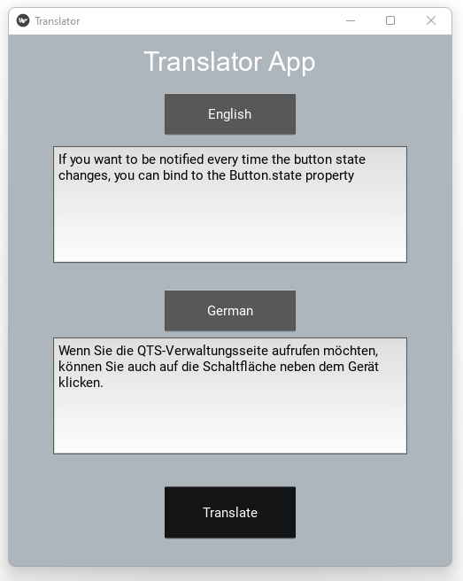
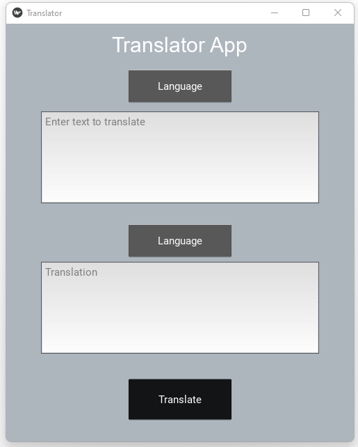
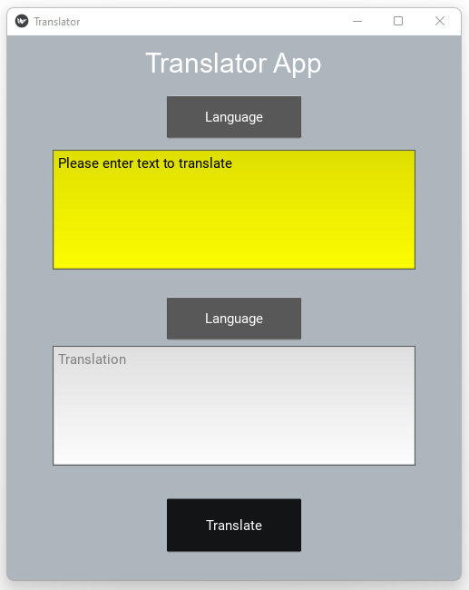

# Translator App

## Overview

The Translator App is a simple application built using Python and Kivy framework. It allows users to translate text from one language to another using the translate library. The app features a user_friendly interface with text input fields, dropdown menus for language selection, and a button to perform the translation.

## Features

- Text Translation: Translate text from one language to another.
- Language Selection: Choose the source and target languages from the dropdown menu.
- User-friendly Interface: Intuitive design and easy-to-use interface with text input fields and buttons.

## Requirements

- Python 3.6 or higher
- Kivy framework
- Translate library

## Installation

1. Clone the repository:

```
git clone
```

2. Install the required libraries:

```
pip install kivy kivymd translate
```

3. Run the application:

```
python Translator_App.py
```

## Usage

1. Enter the text you want to translate in the input field.
2. Select the source and target languages from the dropdown menus.
3. Click the "Translate" button to perform the translation.
4. The translated text will be displayed in the output field.

## Screenshots





## License

This project is licensed under the MIT License - see the [LICENSE](LICENSE) file for details.
